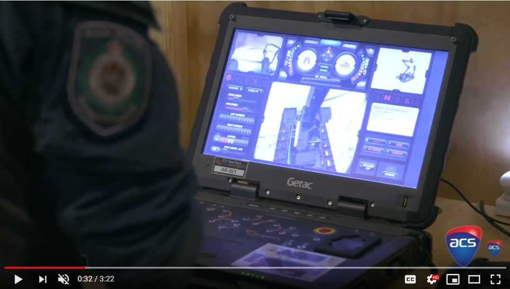
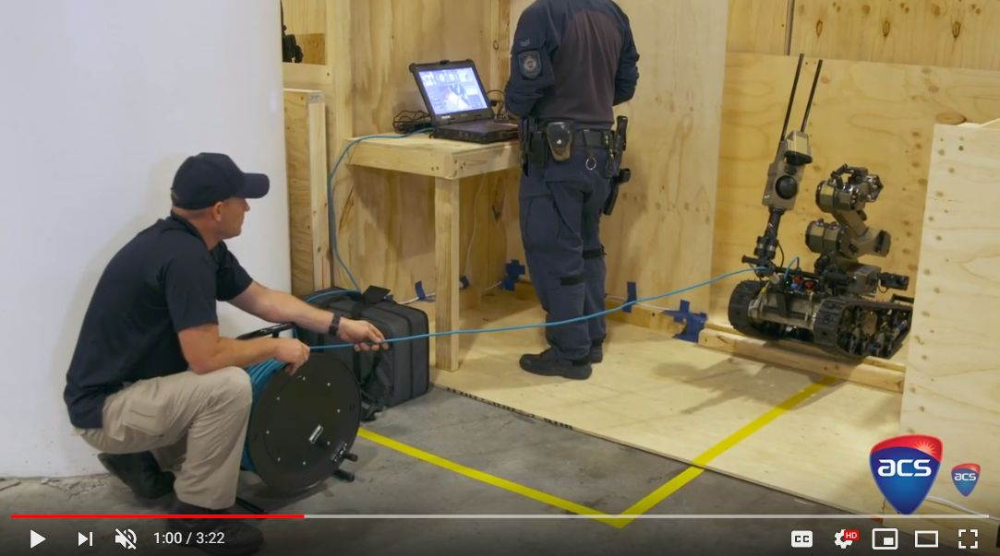

  

<h3 align="center">CS 23302: Robotics and Embedded System Lab Class</h3>

   
  

---

 Wednesday from : 11:00 AM to 12:15 PM - MSB 104 Lab room

## 📝 Table of Contents
+ [1. Notes and Document: doc/](https://github.com/ksu-cs-robotics/2022-Spring_Robotics-and-Embedded-System/tree/master/doc)
+ [2. Source Code: src/](https://github.com/ksu-cs-robotics/2022-Spring_Robotics-and-Embedded-System/tree/master/src)

---

|||
|--|--|
|Class Instructor:|Dr. Jong-Hoon Kim|
|Office Location:|MSB 236-B|
|Office Phone:|330-672-9060|
|e-mail:|jkim72@kent.edu|
|Office Hours:|Monday and Wednesday:   10:30 AM - 11:00 AM (MSB 104)   12:15 PM ~ 13:30 PM (MSB 236-B)   Other times by appointment|
|---|---|

### Prerequisite:
C or better in CS 13001 Computer Programming and CS 23301

### Credits:
CS 233021 ( 2 Credits)

### Course Outline and Objectives:
This course is mainly designed for a sophomore and junior undergraduate students who have an interest in robotics and embedded systems, with a special emphasis on understanding basic hardware and software, and on learning those basics by doing. Thus, this is a lap oriented class providing hands-on-experiences through a selected fun project such as rescueRobot,miniDrone, autonomous miniCar, etc. Further, students may have an
opportunity to participate in various currently ongoing projects which are conducted at several laboratories (ATR Lab, Scale Lab, etc.) in the CS department. Especially, students will gain knowledge and ideas from those projects for their future capstone project in terms of project management as well as advanced technologies in intelligent robot systems, Internet-of-Things, etc.   
The course project will involve significant programming and hardware works. For Spring 2020, mini Rescue Robot project will be conducted. Each student will build a simple ground robot and its control programming from scratch. At the end of the semester, all students will have their final project presentation and mini RobotCup-Rescue competition as parts of class outcomes.

 

<a href = "https://www.youtube.com/watch?v=jhXC-N_kySs"> <h4>[RoboCup Rescue Challenge] </a>

<a href = "https://www.youtube.com/watch?v=YLt52r9IgaQ"> <h4>[An Example Ongoing Project at ATR Lab] </a>

### Learning Outcomes:
Students completing this course will
- learn the theoretical & practical base for robot and control system design by building a simple
drone and control interface
- become familiar with robotics and embedded system
- deepen the knowledge of the robots and their components
- understand how to conduct an individual and group project
- Hand-on-Experience with robot system (drone), embedded system (Arduino), sensors, Python.

### Required Text:
**No Textbook** is required, but various handouts/example-codes/selected hardware for building a ground robot will be provided.

**[Recommended texts for your references]**

1. “Introduction to Multicopter Design and Control”, 1st ed. 2017 Edition. by Quan Quan (Author) - Publisher: Springer - (ISBN-10: 9789811033810)
1. “Physical Computing: Sensing and Controlling the Physical World with Computers” 1st Edition”, Dan O'Sullivan and Tom Igoe, (ISBN-10: 159200346X), (ISBN-13: 978-1592003464)
1. “Arduino Cookbook- 2nd Edition”, Michael Margolis, (ISBN-10: 1449313876) , (ISBN-13:978-1449313876)

### Grading:
Students will be evaluated based on the following course activities and graded based on the following weighting:

|Item|Percentage|(Individual/Group)|
|--|:--:|:--:|
Attendance, Participation, and (in class) Pop Quiz|10%|individual|
|Assignments|20%|individual|
|Midterm Exam|10%|individual|
|Robot competition|20%|individual|
|Final Report & Presentations|20%|individual|
|Final Exam|20%|individual|
|Total|100%|--|

|Grade|Total Percentage Earned|Grade|Total Percentage Earned|
|:--:|:--:|:--:|:--:|
|A|92.5 – 100% or above|C+|77.5 – 79.9%|
|A-|89.5 – 92.4%|C|72 – 77.4%|
|B+|87 – 89.4%|C-|68.5 – 71.9 %|
|B|82.5 – 86.9%|D|68.5 – 71.9 %|
|B-|80 – 82.4%|F|62% and below|

- **Assignments:** Simple programming and hardware building assignments for this course will be given. Some simple questions may also be posted on Blackboard LEARN for lectures or labs, and answers to these questions should be submitted through BLACK Board by the due date.
- **In-class Participation** This is a highly lab oriented class so active participation is particularly required.
- **Projects:** The project activity is the majority of your out-of-class work for the semester. You willperform individual project work, consistent throughout the semester. You will build a robot (a simple quadcopter by DIY). In addition, each student may have an opportunity to participate currently ongoing projects which are conducted at several laboratories and learn documentation and management of projects as well as the design and prototyping process.

### Tentative Outline of the Course:

||||
|--|--|--|
|Week1| Introduction of Robotics and Embedded System Lab course, schedule/requirements|
|Week2| Setup Development Environment (Arduino and GitHub)& Review RES-1 ( Mechatronic and Arduino Basic) |
|Week3| Communication - ISP (Boot Loader), I2C Basic (OLED) |
|Week4| IMU (I2C)|
|Week5| Protocol Design (Message Frame/ Encode-Decode/ Error Detection)|
|Week6| Microcontroller (Midterm) and PCB Design and Manufacturing Process|
|Week7| Interrupt and encoder |
|Week8| Proximity Sensors   |
|Week9| Interrupt and encoder |
|Week10| PID Control |
|Week11| Localization - 1 (Odometry, Linear and Angular Velocity)|
|Week12| Localiazation -2 ( Runge–Kutta methods) |
|Week13| Thanksgiving Break
|Week14| System Intergraion and Special Topic |
|Week15| Final Project Presentation & Demo/Competition- (10min presentation & 5 min QnA)|
|Week16| **Final Exam Week** if needed|

### Course policy:
1. **Class participation and preparation**
    - Class participation and regular attendance are expected. If a student misses a class, the student is responsible for bringing herself/himself up-to-date on class material and assignments. If you miss more than 4 classes without a documented reason or without making prior arrangements with me, your final grade will be dropped one grade (A to B, B+ to C+ and so on).
    - All students are expected to read the assigned chapters prior to coming to class.
1. **Exams**
    - Exams will be based on the combination of: material covered in lectures, the assigned reading from the reference papers/textbooks and material covered in the notes.
    - All exams are closed books and closed notes.
1. **Homework assignments**
    - All homework assignments must be returned through the Blackboard LEARN. If the instructor requests to return an assignment directly in class, the assignment is due at the beginning of class on the specified date. Assignments turned in after the beginning of class on the due date will be counted as one day late and will receive 3 points of penalty.
    - Late penalty will be applied to all the assignment returned late. An assignment turned in n days late will get 3*n points deduction. An assignment cannot be more than 7 days late. After the 7th day the assignment will not be accepted.
    - All assignments must be individually and independently completed. Should two or more students turn in substantially the same solution or program, in the judgment of the instructor, the solution will be considered a group effort. All involved in group effort homework will receive a zero grade for that assignment. (See more details on cheating and plagiarism in the Academic Honesty Policy section below).
    - You may discuss the interpretation of an assignment with your classmates; however you may not discuss possible solutions unless you are requested by your teacher to share your solution with your colleagues.
    - No late assignment will be accepted after the assignment is graded and solution discussed.
1. **Make-up exams**
    - Make-up exams will only be given in case of serious need and only when the instructor is notified prior to the exam time. If this is not done, the grade is automatically 0 for that exam.
    - Written verification for the student’s inability to take an exam will be required.
1. **Class cancellation & Campus closings**
    - Announcements of class cancellations and/or campus closings will be made on the campus homepage. In the case of an emergency, weather-related or otherwise, please check the web page at www.kent.edu for information on the buildings and times of the closing. While information may be broadcast by radio and television, this should be confirmed by the web page, which is the official announcement of the campus and which will be the information used to determine issues related to student attendance, rescheduling of tests, and other concerns.
    - If I need to cancel class for any reason, I will try to put an announcement on the course web page as early as possible.
1. **Course Withdrawal**
    - If you are considering withdrawing from this course, please consult with a staff member in the Student Services Office, 134 Main Hall. Withdrawal from a course can affect financial aid, student status, or progress within your major. For withdrawal deadlines, please refer to: http://www.kent.edu/registrar/spring-important-dates.
1. **Academic Honesty**
    - Use of the intellectual property of others without attributing it to them is considered a serious academic offense. Cheating or plagiarism will result in a failing grade for the work or for the entire course. Repeat offenses result in dismissal from the University. University guidelines require that all infractions be reported to the Student Conduct Officer on our campus. Kent State University policy on academic honesty can be found at: http://www.kent.edu/plagiarism
1. **Students with Disabilities**
    - University policy 3-01.3 requires that students with disabilities be provided reasonable accommodations to ensure their equal access to course content. If you have a documented disability and require accommodations, please contact the instructor at the beginning of the semester to make arrangements for necessary classroom adjustments. Please note, you must first verify your eligibility for these through Student Accessibility Services (contact 330-672-3391 or visit http://www.kent.edu/sas for more information on registration procedures).
1. **Conduct**
    - Students and faculty behavior at the Kent State University is governed by the guidelines summarized in the Code of Conduct page that you can find at
http://www.kent.edu/studentconduct/code-studentconduct.
1. **Emergency**
    - In case of an emergency please contact the security on campus.
      - Pick up the receiver of any blue-light phone on campus
      - Security cell phone (330) 672-2212 or, of course, 911.
